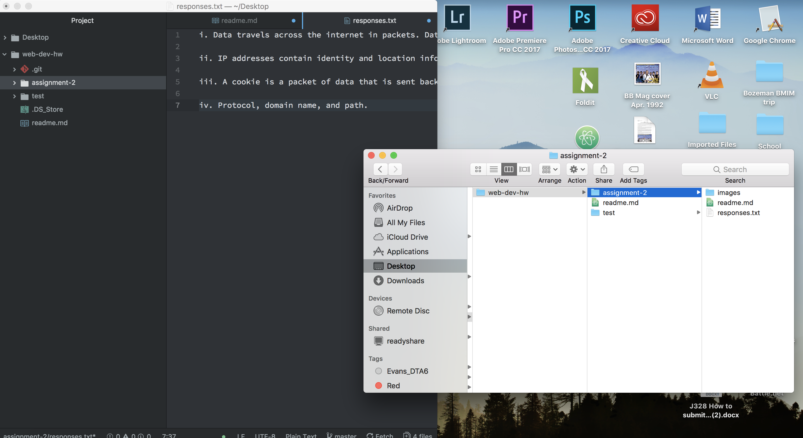

# Assignment 2

A Version Control System like Github is a data saving and sharing application. We use it because it allows us to track the edits we've made. This enables us to see what changes may have led to problems in our files.

Link to my [Assignment 2](./responses.txt) responses

This assignment was important for me because:

-A computer crash reminded me to be constantly saving as I make edits in atom.

