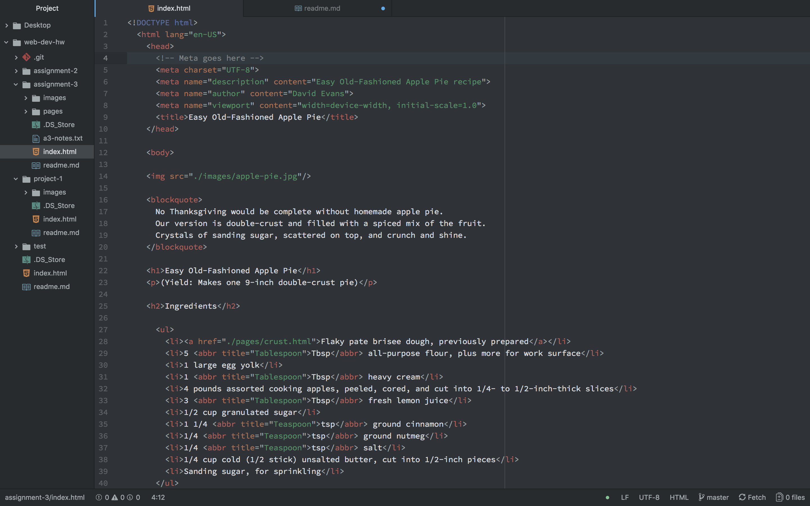

# Assignment 3 readme.md
## David Evans

### Head
The head of the site contains meta data and info about the site and is not visible to visitors.

### Body
The body contains the bulk of the site and it's contents are visible to viewers.

### Structural Markup
Structural Markup contains info about the structure of a document and includes things like headings, paragraphs, lists and breaks.

### Semantic Markup
Semantic Markup is used to define the meaning of the info in a document by allowing us to place emphasis on certain words or phrases. With semantic markup we can italicize or bolden words as well as insert citations and addresses.

### Work Cycle
This assignment took me much longer than the first two but was packed with a ton of new things I hadn't previously learned.

### My Atom Screenshot

