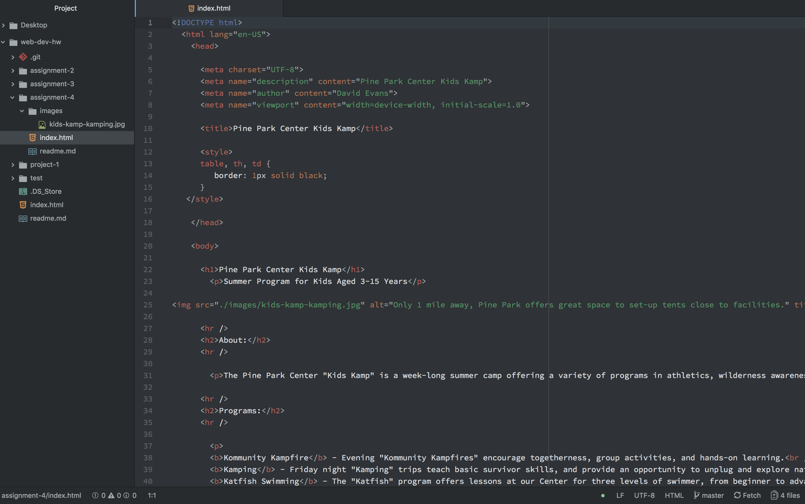

# Assignment 4 readme.md
## David Evans

### Alt Text
Alt Text can provide details about an element that aren't shown until the cursor scrolls over the element.

### Forms
I come across forms all the time on the web but the one I see most often would probably be the login page for moodle. Forms allow us to choose options from a dropdown menu, create buttons and login boxes.

### Work Cycle
Creating the forms and assigning the inputs was very difficult and time consuming but provided valuable insite into how a website works.

### My Atom Screenshot

