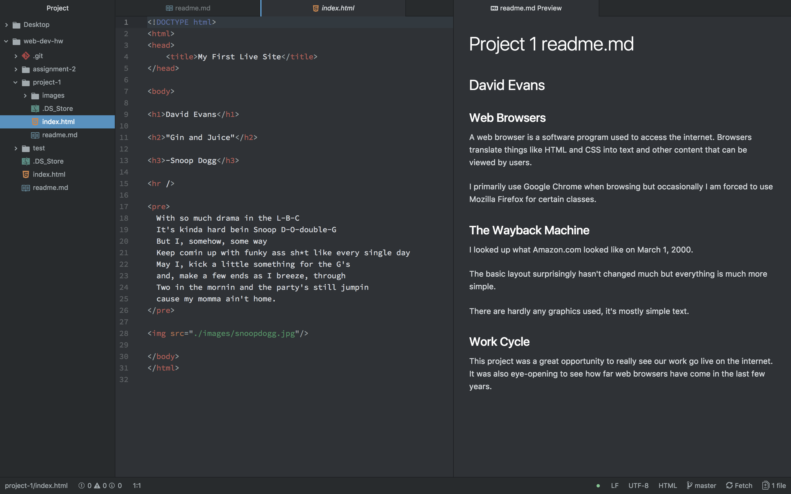

# Project 1 readme.md
## David Evans

### Web Browsers
A web browser is a software program used to access the internet. Browsers translate things like HTML and CSS into text and other content that can be viewed by users.

I primarily use Google Chrome when browsing but occasionally I am forced to use Mozilla Firefox for certain classes.

### The Wayback Machine
I looked up what Amazon.com looked like on March 1, 2000.

The basic layout surprisingly hasn't changed much but everything is much more simple.

There are hardly any graphics used, it's mostly simple text.

### Work Cycle
This project was a great opportunity to really see our work go live on the internet. It was also eye-opening to see how far web browsers have come in the last few years. 

### My Atom Screenshot

